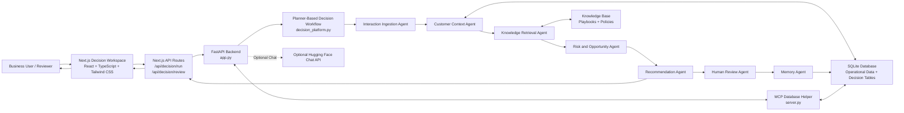

# Nxt-B-Step Architecture

## Overview

Nxt-B-Step is an agentic decision intelligence platform for staffing and background screening workflows. It converts customer interactions, operational screening data, and policy/playbook knowledge into explainable next-best-action recommendations that can be approved, edited, or rejected by a human reviewer.

The implementation is split into a Python FastAPI backend and a Next.js frontend. The backend owns orchestration, SQLite data access, recommendation generation, review persistence, and decision memory. The frontend provides an operator workspace where a user can paste a customer issue, run the planner, inspect reasoning, and review recommendations.

## Architecture Diagram



## High-Level Components

### Frontend: Decision Workspace

- Location: `frontend/`
- Framework: Next.js 15, React 19, TypeScript, Tailwind CSS, shadcn/ui-style components, Lucide icons
- Main screen: `frontend/components/decision/decision-workspace.tsx`
- API bridge routes:
  - `frontend/app/api/decision/run/route.ts`
  - `frontend/app/api/decision/review/route.ts`
  - `frontend/app/api/chat/route.ts`

The workspace captures an interaction, calls the backend through Next.js API routes, and renders:

- planner trace
- extracted business signals
- risks, opportunities, and missing information
- retrieved order/search context
- matched knowledge evidence
- ranked recommendations with confidence and reasoning
- human review actions
- decision memory events

### Backend: FastAPI Orchestration Service

- Location: `backend/`
- Entry point: `backend/app.py`
- Decision workflow: `backend/decision_platform.py`
- Database/MCP helper: `backend/server.py`
- Seed data: `backend/seed_data.py`
- Runtime data store: SQLite database at `backend/accurate.db` after seeding/running

The backend exposes:

- `POST /decision/run` to execute the decision workflow
- `POST /decision/review` to record human review feedback
- `POST /chat` for an AI-assisted chat interface with database tools
- `GET /` health response

## Decision Workflow

The main reusable workflow is implemented in `run_decision_workflow` inside `backend/decision_platform.py`.

1. Planner Agent
   - Decomposes the request into ingestion, retrieval, analysis, recommendation, review, and memory steps.

2. Interaction Ingestion Agent
   - Normalizes the interaction text.
   - Extracts business signals such as escalation, pending delay, discrepancy, compliance-sensitive search, and missing information.
   - Attempts to identify candidate and customer names.

3. Customer Context Agent
   - Queries SQLite operational tables for relevant orders, search statuses, package details, subjects, and companies.
   - Produces portfolio-level or subject-matched context.

4. Knowledge Retrieval Agent
   - Matches extracted signals against an in-code knowledge base of playbooks and risk policies.
   - Returns the most relevant guidance for the current decision state.

5. Risk and Opportunity Agent
   - Identifies SLA risk, discrepancy risk, compliance-sensitive risk, missing identifiers, and proactive communication opportunities.

6. Recommendation Agent
   - Generates ranked next-best actions.
   - Each recommendation includes priority, confidence, reasoning, and evidence.

7. Human Review Agent
   - Holds generated recommendations in `pending_review`.
   - Supports reviewer statuses: `approved`, `edited`, and `rejected`.

8. Memory Agent
   - Stores workflow runs and human review outcomes in `memory_events`.
   - Enables later workflows to surface recent decision patterns.

## Data Model

Operational seed tables:

- `company`
- `subject`
- `package`
- `order_request`
- `search`
- `search_type`
- `search_status`

Decision intelligence tables:

- `interactions`
- `recommendations`
- `memory_events`

Chat/session table:

- `chat_sessions`

## API Flow

```text
User
  -> Next.js Decision Workspace
  -> Next.js API route (/api/decision/run)
  -> FastAPI backend (/decision/run)
  -> SQLite operational data + knowledge base + decision memory
  -> Ranked recommendations and planner trace
  -> Next.js UI
  -> Human review action
  -> Next.js API route (/api/decision/review)
  -> FastAPI backend (/decision/review)
  -> SQLite memory_events
```

## Key Design Decisions

- Planner-based orchestration instead of a single chatbot response: the workflow is decomposed into specialized steps so the UI can show traceable reasoning.
- Explainability by default: each recommendation includes confidence, reasoning, and evidence from business signals, operational records, and knowledge guidance.
- Human-in-the-loop governance: recommendations are not treated as final actions until a reviewer approves, edits, or rejects them.
- Local SQLite for hackathon portability: the project can be run locally without external database infrastructure.
- Lightweight knowledge retrieval: the initial knowledge base is code-defined, making the demo deterministic and reusable without a vector database dependency.
- Next.js API proxy layer: the frontend calls local API routes, while the backend URL can be configured through `NEXT_PUBLIC_API_URL`.
- Optional AI chat path: Hugging Face integration is supported for chat, but the main next-best-action workflow works through deterministic rule-based orchestration.

## Extensibility

The platform can be adapted to other business domains by replacing:

- operational database schema and queries
- knowledge base playbooks and risk policies
- signal extraction rules
- recommendation templates
- review statuses and memory event categories

This keeps the core pattern reusable: ingest interaction, retrieve enterprise context, reason over risk/opportunity, recommend an action, collect human feedback, and learn from the outcome.
