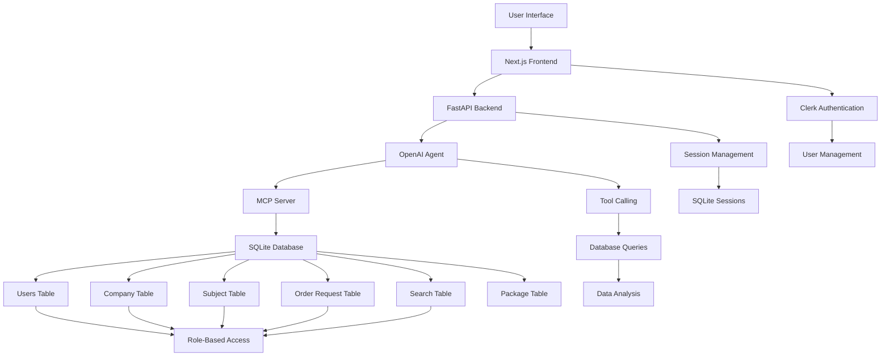
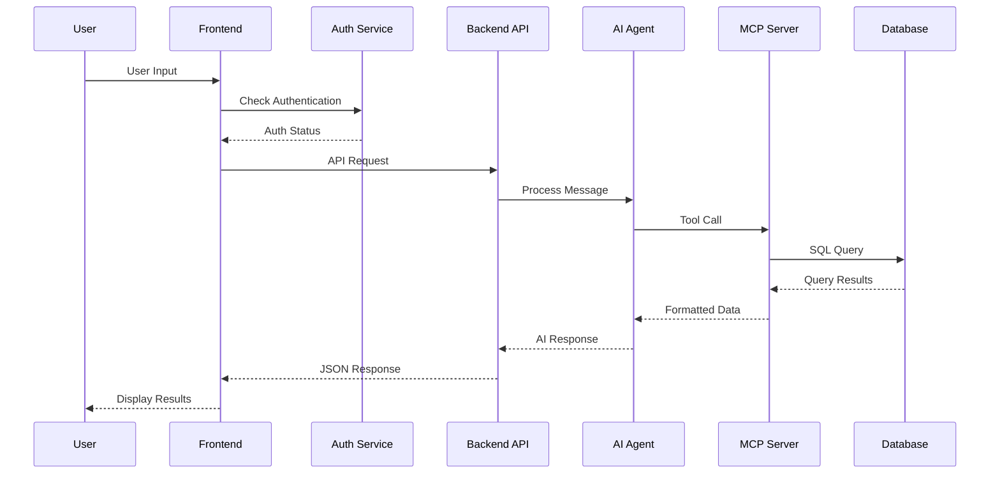
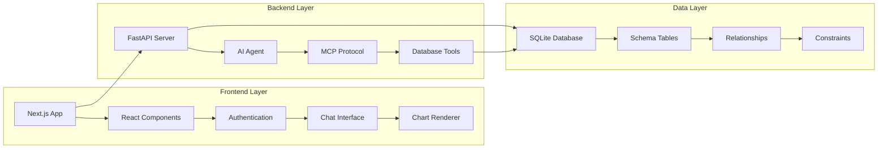
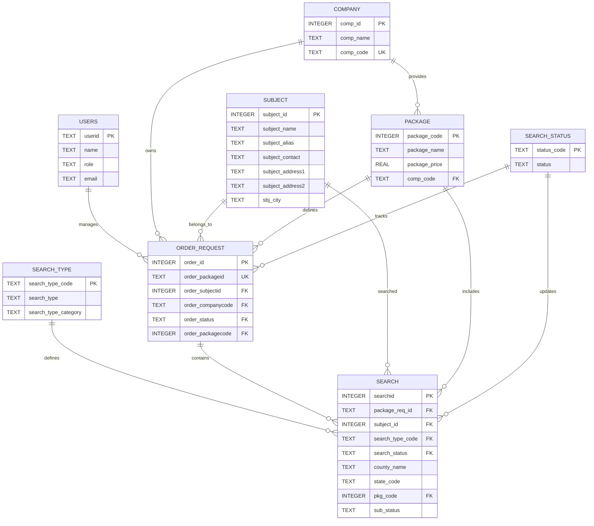

# VNR-TEAMX - Agent A - Accurate AI Agent
Hackathon Repo for VNR Team - Team X - [Deployed Link](https://agent-a-rho.vercel.app/) - [PPT](https://www.canva.com/design/DAGzncxT3ys/PEL-71baFXBPv771McgiFw/edit?utm_content=DAGzncxT3ys&utm_campaign=designshare&utm_medium=link2&utm_source=sharebutton)

[](https://python.org)
[](https://nextjs.org)
[](https://fastapi.tiangolo.com)
[](https://typescriptlang.org)
[](https://sqlite.org)
[](https://tailwindcss.com)

## Table of Contents
- [Project Overview](#project-overview)
- [Installation & Setup](#installation--setup)
- [Key Features](#key-features)
- [Technology Stack](#technology-stack)
- [System Architecture](#system-architecture)
- [Usage Guide](#usage-guide)
- [API Documentation](#api-documentation)
- [Database Schema](#database-schema)
- [Project Structure](#project-structure)

## Project Overview

**Accurate DecisionOS** is a reusable agentic decision intelligence platform built for the hackathon challenge: Intelligent Next Best Action Platform. It turns customer interactions, operational context, and organizational knowledge into explainable next-best actions with human review and memory.

### Hackathon Challenge Alignment
- **Planner-based orchestration**: a planner agent coordinates reasoning over the incoming case
- **Reusable architecture**: the same workflow can be adapted to onboarding, customer success, sales, support, or operations
- **Explainable recommendations**: every suggestion includes reasoning, evidence, and confidence
- **Human-in-the-loop review**: recommendations can be approved, rejected, or edited before execution
- **Memory-driven improvement**: prior interactions and review outcomes help improve future recommendations

### Business Problems Solved
- **Slow response handling**: teams spend too much time interpreting customer issues and deciding next steps
- **Context scattering**: relevant customer history and policy guidance are often stored in different places
- **Inconsistent decisions**: different teammates may choose different actions without shared reasoning
- **Lack of explainability**: recommendations are hard to justify to customers, leads, or reviewers

### Solution Approach
- **Natural language intake**: users can paste emails, meeting notes, CRM updates, or support escalations
- **Context gathering**: the planner pulls in operational data and relevant knowledge sources
- **Decision analysis**: risks, opportunities, and missing information are surfaced clearly
- **Action generation**: the platform suggests the next best action with supporting evidence
- **Review workflow**: human reviewers can approve or refine recommendations before they are acted on
- **Portable design**: the same architecture can be reused for different B2B domains beyond background checks

## Installation & Setup

### Prerequisites
- **Node.js** 18+ or **Bun** runtime
- **Python** 3.8+

### Backend Setup

1. **Navigate to Backend Directory**
   ```bash
   cd backend
   ```

2. **Create Virtual Environment**
   ```bash
   python -m venv venv
   source venv/bin/activate  # On Windows: venv\Scripts\activate I used Ubuntu
   ```

3. **Install Dependencies**
   ```bash
   pip install -r requirements.txt
   ```

4. **Environment Configuration**
   Create `.env` file in backend directory:
   ```env
   OPENAI_API_KEY=your_openai_api_key_here
   ```

5. **Database Initialization**
   ```bash
   cd playground
   python create.py  # Creates database schema
   python users.py   # Populates user data
   python adata.py   # Extra, Adds Completed Orders
   cd ..
   ```
   Move the accurate.db file to backend folder

6. **Start Backend Server**
   ```bash
   python app.py
   ```
   Backend will be available at `http://localhost:8000`
   API will be available at `http://localhost:8000/chat`

### Frontend Setup

1. **Navigate to Frontend Directory**
   ```bash
   cd frontend
   ```

2. **Install Dependencies**
   ```bash
   bun install  # or npm install
   ```

3. **Environment Configuration**
   Create `.env.local` file:
   ```env
   # Clerk Authentication
   NEXT_PUBLIC_CLERK_PUBLISHABLE_KEY=your_clerk_publishable_key
   CLERK_SECRET_KEY=your_clerk_secret_key

   # API Configuration
   NEXT_PUBLIC_API_URL=http://localhost:8000
   ```

4. **Start Development Server**
   ```bash
   bun dev  # or npm run dev
   ```
   Frontend will be available at `http://localhost:3000`

## Key Features

### AI-Powered Chat Interface
- **Natural Language Processing**: Query background check data using conversational language without any extra effort.
- **Context-Aware Responses**: AI understands the background check lifecycle and provides relevant insights based on data.
- **Intelligent Chart Generation**: Visual representations of data with support for various graphs and provides when needed
- **Follow-up Questions**: AI suggests relevant follow-up queries based on conversation context and data patterns
- **Multi-Table Query Support**: Seamlessly query across related tables (orders, subjects, companies, search results) without complex joins
- **Intelligent Data Interpretation**: AI explains complex background check data in easy-to-understand business terms
- **Historical Conversation Context**: Maintains conversation history to provide contextually relevant responses

### Multi-Role Authentication System
- **Admin Access**: Full system access with complete data visibility across all companies, subjects, and orders
- **Company Access**: Limited to their organization's background check data with filtered views based on company codes
- **Subject Access**: Personal background check information access with privacy-focused data restrictions
- **Guest Mode**: Limited functionality for unauthenticated users to explore basic features
- **Session Management**: Persistent sessions with proper authentication and secure data access
- **Role-Based Data Filtering**: Automatic data filtering based on user role and permissions
- **Audit Trail In Agent**: Track user activities and data access for developement

### Comprehensive Data Analytics
- **Order Status Tracking**: Real-time visibility into background check progress with completion percentages and timelines
- **Package Performance**: Analysis of different background check package effectiveness and cost-performance ratios
- **Geographic Distribution**: Location-based analysis of background check requests with state-wise and county-wise breakdowns
- **Search Type Analytics**: Performance metrics across different verification types (MVR, Employment, Criminal, etc.)
- **Trend Analysis**: Historical data analysis to identify patterns in background check completion times and success rates (works when prompted still need to work)

## Technology Stack

### Frontend Technologies
| Component | Technology | Purpose |
|-----------|------------|---------|
| **Framework** | Next.js 15 | Full-stack React framework with App Router |
| **Language** | TypeScript | Type-safe JavaScript development |
| **Styling** | Tailwind CSS | Utility-first CSS framework |
| **UI Components** | Radix UI | Accessible, customizable UI component library |
| **Animations** | Framer Motion | Declarative animations and gestures |
| **Charts** | Recharts | Composable charting library for React |
| **Authentication** | Clerk | Complete authentication and user management |

### Backend Technologies
| Component | Technology | Purpose |
|-----------|------------|---------|
| **Web Framework** | FastAPI | High-performance REST API with automatic OpenAPI documentation |
| **AI Integration** | OpenAI Agents | Advanced conversational AI with tool calling capabilities |
| **Database Protocol** | MCP (Model Context Protocol) | Standardized interface for AI-database interactions |
| **Database** | SQLite | Lightweight, serverless database for development and testing |
| **Environment** | Python 3.8+ | Backend runtime environment |

## System Architecture

### High-Level Architecture
This diagram illustrates the overall system architecture, showing how different components interact with each other from the user interface down to the database layer. It demonstrates the complete data flow and access control mechanisms that enable secure, role-based interactions with the background check data.

**Component Breakdown:**
- **User Interface**: The entry point where users interact with the system through a web browser
- **Next.js Frontend**: React-based frontend application handling user interactions and rendering the chat interface
- **Clerk Authentication**: Third-party authentication service managing user registration, login, and session management
- **FastAPI Backend**: High-performance Python web framework handling API requests and orchestrating AI interactions
- **OpenAI Agent**: Advanced conversational AI that processes natural language queries and generates intelligent responses
- **MCP Server**: Model Context Protocol server providing standardized database access tools for the AI agent
- **SQLite Database**: Lightweight relational database storing all background check data with proper relationships
- **Session Management**: Handles persistent chat sessions and conversation history
- **Database Tables**: Core data entities including users, companies, subjects, orders, and search results
- **Role-Based Access**: Security layer ensuring users only access data appropriate to their role (admin/company/subject)



### Data Flow Architecture
This sequence diagram shows the step-by-step flow of data through the system when a user interacts with the chat interface. It demonstrates how natural language input is processed through multiple layers to generate intelligent responses with proper authentication and data access controls.

**Process Flow:**
1. **User Input**: User submits a natural language query through the chat interface
2. **Authentication Check**: Frontend validates user credentials via Clerk authentication service
3. **API Request**: Authenticated request is sent to the FastAPI backend with user context
4. **AI Processing**: OpenAI agent analyzes the query and determines required database operations
5. **Tool Execution**: MCP server executes specific database tools (querydb, get_schema, get_tables)
6. **Data Retrieval**: SQLite database returns requested background check information
7. **Response Generation**: AI agent formats the data and generates natural language response
8. **Display**: Frontend renders the response with any charts or visualizations



### Component Architecture
This diagram shows the layered architecture of the system, separating concerns between the frontend presentation layer, backend logic layer, and data persistence layer. Each layer has specific responsibilities and communicates through well-defined interfaces.

**Layer Descriptions:**

**Frontend Layer (Presentation Layer):**
- **Next.js App**: Main application container managing routing and state
- **React Components**: Reusable UI components built with TypeScript for type safety
- **Authentication**: Integration with Clerk for secure user authentication and session management
- **Chat Interface**: Interactive chat component handling user input and displaying AI responses
- **Chart Renderer**: Component responsible for rendering data visualizations using Recharts

**Backend Layer (Logic Layer):**
- **FastAPI Server**: High-performance web server handling HTTP requests and responses
- **AI Agent**: OpenAI-powered conversational agent with custom instructions for background check domain
- **MCP Protocol**: Model Context Protocol implementation providing database access tools
- **Database Tools**: Specific tools for querying database, getting schemas, and listing tables

**Data Layer (Persistence Layer):**
- **SQLite Database**: File-based relational database storing all application data
- **Schema Tables**: Structured tables with proper relationships and constraints
- **Relationships**: Foreign key relationships ensuring data integrity
- **Constraints**: Database-level constraints maintaining data consistency



## Usage Guide

### Getting Started
1. **Access the Application**: Open `http://localhost:3000` in your browser
2. **Authentication Options**:
   - Sign up/in with Clerk authentication
   - Continue as guest for limited functionality
3. **Start Chatting**: Use the chat interface to ask questions about background checks

### Sample Queries
The AI understands various types of background check related questions:

```
"Show me the distribution of order statuses"
"What types of background checks are most common?"
"Which states have the most background check requests?"
"Show me pending orders by company"
"Generate a pie chart of package distribution"
```

### Role-Based Access Examples

#### Admin User
```sql
-- Full access to all data
SELECT * FROM order_request WHERE order_status = 'PENDING'
```

#### Company User
```sql
-- Limited to company-specific data
SELECT * FROM order_request WHERE order_companycode = 'ABC123'
```

#### Subject User
```sql
-- Limited to personal data
SELECT * FROM order_request WHERE order_subjectid = 12345
```

## API Documentation

### Chat Endpoint
```http
POST /chat
Content-Type: application/json

{
  "message": "Show me pending orders",
  "sessionid": "user_session_123",
  "userid": "user@example.com"
}
```

**Response:**
```json
{
  "message": "Based on your query, here are the pending orders...",
  "followup": [
    "Would you like to see the details of a specific order?",
    "Should I generate a chart showing the status distribution?",
    "Do you want to filter by a specific company?"
  ]
}
```

### Database Tools (MCP Protocol)

#### Query Database
```javascript
// Tool: querydb
{
  "sql": "SELECT COUNT(*) as count, order_status FROM order_request GROUP BY order_status"
}
```

#### Get Table Schema
```javascript
// Tool: get_schema
{
  "table_name": "order_request"
}
```

#### List Tables
```javascript
// Tool: get_tables
// Returns array of table names
```

## Database Schema

### Core Tables

#### Users Table
```sql
CREATE TABLE users (
    userid TEXT PRIMARY KEY,        -- Unique identifier
    name TEXT NOT NULL,            -- User display name
    role TEXT NOT NULL,            -- 'admin', 'company', 'subject'
    email TEXT UNIQUE              -- User email address
);
```

#### Company Table
```sql
CREATE TABLE company (
    comp_id INTEGER PRIMARY KEY,   -- Company ID
    comp_name TEXT,                -- Company name
    comp_code TEXT UNIQUE          -- Company code for orders
);
```

#### Subject Table
```sql
CREATE TABLE subject (
    subject_id INTEGER PRIMARY KEY, -- Subject ID
    subject_name TEXT,              -- Full name
    subject_alias TEXT,             -- Alternative names
    subject_contact TEXT,           -- Contact information
    subject_address1 TEXT,          -- Primary address
    subject_address2 TEXT,          -- Secondary address
    sbj_city TEXT                   -- City location
);
```

#### Package Table
```sql
CREATE TABLE package (
    package_code INTEGER PRIMARY KEY, -- Package ID
    package_name TEXT,                 -- Package name
    package_price REAL,                -- Package cost
    comp_code TEXT,                    -- Company reference
    FOREIGN KEY (comp_code) REFERENCES company(comp_code)
);
```

#### Search Status Table
```sql
CREATE TABLE search_status (
    status_code TEXT PRIMARY KEY,      -- Status code
    status TEXT                        -- Status description
);
```

#### Search Type Table
```sql
CREATE TABLE search_type (
    search_type_code TEXT PRIMARY KEY, -- Search type code
    search_type TEXT,                  -- Search type description
    search_type_category TEXT          -- Search category
);
```

#### Order Request Table
```sql
CREATE TABLE order_request (
    order_id INTEGER PRIMARY KEY,        -- Order ID
    order_packageid TEXT UNIQUE,         -- Package identifier
    order_subjectid INTEGER,             -- Subject reference
    order_companycode TEXT,              -- Company reference
    order_status TEXT,                   -- Status code
    order_packagecode INTEGER,           -- Package reference
    FOREIGN KEY (order_subjectid) REFERENCES subject(subject_id),
    FOREIGN KEY (order_companycode) REFERENCES company(comp_code),
    FOREIGN KEY (order_status) REFERENCES search_status(status_code),
    FOREIGN KEY (order_packagecode) REFERENCES package(package_code)
);
```

#### Search Table
```sql
CREATE TABLE search (
    searchid INTEGER PRIMARY KEY,        -- Search ID
    package_req_id TEXT,                 -- Order reference
    subject_id INTEGER,                  -- Subject reference
    search_type_code TEXT,               -- Search type
    search_status TEXT,                  -- Status
    county_name TEXT,                    -- County searched
    state_code TEXT,                     -- State code
    pkg_code INTEGER,                    -- Package reference
    sub_status TEXT,                     -- Detailed status
    FOREIGN KEY (package_req_id) REFERENCES order_request(order_packageid),
    FOREIGN KEY (subject_id) REFERENCES subject(subject_id),
    FOREIGN KEY (search_type_code) REFERENCES search_type(search_type_code),
    FOREIGN KEY (search_status) REFERENCES search_status(status_code),
    FOREIGN KEY (pkg_code) REFERENCES package(package_code)
);
```

### Relationships
This ER diagram shows the correct relationships between all database tables based on the actual schema defined in the system:



## Project Structure

```
project/
├── backend/                # Python FastAPI backend
│   ├── agents/             # AI agent definitions
│   ├── accurate.db         # SQLite database
│   ├── app.py              # Main FastAPI application
│   ├── server.py           # MCP server implementation
│   └── requirements.txt    # Python dependencies
├── frontend/               # Next.js React frontend
│   ├── app/                # Next.js app directory
│   │   ├── api/            # API routes
│   │   ├── components/     # React components
│   │   └── page.tsx        # Home page
│   ├── components/         # Reusable components
│   │   ├── auth/           # Authentication components
│   │   ├── mvpblocks/      # Main UI blocks
│   │   └── ui/             # UI component library
│   └── package.json        # Node.js dependencies
├── playground/             # Data setup and utilities
│   ├── create.py           # Database schema creation
│   ├── users.py            # User data population
│   ├── adata.py            # Sample data insertion
│   ├── migrate.py          # Excel to SQLite migration script
│   ├── basetest.py         # Simple CLI chat test script
│   ├── test.py             # Streamlit chatbot UI for testing
│   ├── clean.py            # Data cleaning utilities
│   └── dataset.xlsx        # Excel data source
└── README.md               # This file
```

## Acknowledgments

Thanks for Team Accurate for a Great Hackathon Experience, and Working on Agent A was a Great Experience for all my Team.

For support or questions, please contact me via email @ [itsbharathajjarapu@gmail.com](mailto:itsbharathajjarapu@gmail.com).
