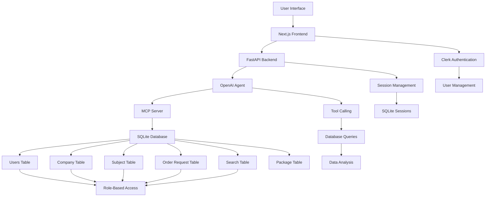
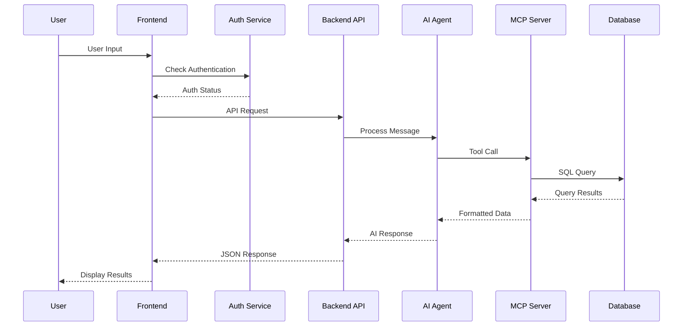
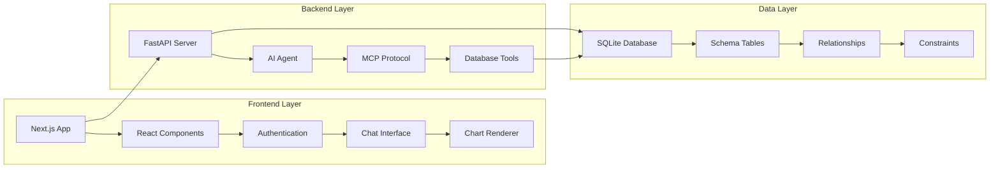
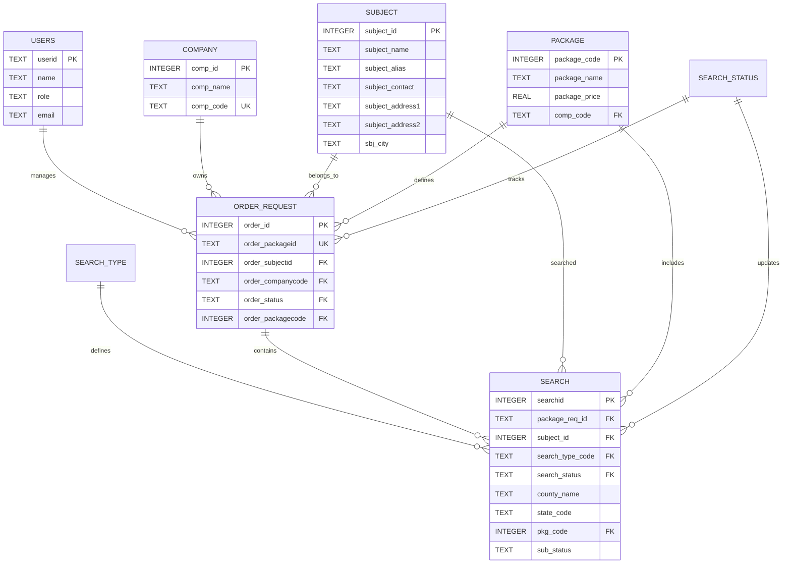

# 🔍 Accurate AI - Background Check Management System

[](https://python.org)
[](https://nextjs.org)
[](https://fastapi.tiangolo.com)
[](https://typescriptlang.org)
[](https://sqlite.org)
[](https://tailwindcss.com)

## 📋 Table of Contents
- [Project Overview](#-project-overview)
- [Key Features](#-key-features)
- [Technology Stack](#-technology-stack)
- [System Architecture](#-system-architecture)
- [Installation & Setup](#-installation--setup)
- [Usage Guide](#-usage-guide)
- [API Documentation](#-api-documentation)
- [Database Schema](#-database-schema)
- [Project Structure](#-project-structure)
- [Development](#-development)
- [Deployment](#-deployment)
- [Contributing](#-contributing)
- [License](#-license)

## 🎯 Project Overview

**Accurate AI** is an intelligent background check management system designed for HR professionals and recruitment agencies. The system provides an AI-powered chat interface that enables users to query comprehensive background check data through natural language conversations.

The platform combines modern web technologies with artificial intelligence to deliver fast, accurate insights about background verification processes, order statuses, and detailed search results across multiple data dimensions.

### Core Problem Solved
- **Complex Data Queries**: Traditional background check systems require SQL knowledge to extract meaningful insights
- **Time-Consuming Analysis**: Manual data analysis slows down HR decision-making processes
- **Limited Accessibility**: Background check data often exists in silos, making comprehensive analysis difficult

### Solution Approach
- **Natural Language Interface**: Ask questions in plain English instead of writing complex SQL queries
- **Role-Based Access**: Different user types (admin, company, subject) see only relevant data
- **Intelligent Data Analysis**: AI automatically generates charts and visualizations from query results
- **Real-Time Insights**: Instant access to background check statuses and detailed search results

## ✨ Key Features

### 🤖 AI-Powered Chat Interface
- **Natural Language Processing**: Query background check data using conversational language
- **Context-Aware Responses**: AI understands the background check lifecycle and provides relevant insights
- **Automated Chart Generation**: Visual representations of data trends and distributions
- **Follow-up Questions**: AI suggests relevant follow-up queries based on conversation context

### 🔐 Multi-Role Authentication System
- **Admin Access**: Full system access with complete data visibility
- **Company Access**: Limited to their organization's background check data
- **Subject Access**: Personal background check information access
- **Guest Mode**: Limited functionality for unauthenticated users

### 📊 Comprehensive Data Analytics
- **Order Status Tracking**: Real-time visibility into background check progress
- **Package Performance**: Analysis of different background check package effectiveness
- **Geographic Distribution**: Location-based analysis of background check requests
- **Search Type Analytics**: Performance metrics across different verification types

### 🎨 Modern User Experience
- **Responsive Design**: Optimized for desktop, tablet, and mobile devices
- **Smooth Animations**: Framer Motion powered interactions and transitions
- **Dark/Light Theme**: Automatic theme switching based on user preference
- **Chat History**: Persistent conversation history with search functionality

## 🛠 Technology Stack

### Backend Technologies
| Component | Technology | Purpose |
|-----------|------------|---------|
| **Web Framework** | FastAPI | High-performance REST API with automatic OpenAPI documentation |
| **AI Integration** | OpenAI Agents | Advanced conversational AI with tool calling capabilities |
| **Database Protocol** | MCP (Model Context Protocol) | Standardized interface for AI-database interactions |
| **Database** | SQLite | Lightweight, serverless database for development and testing |
| **Environment** | Python 3.8+ | Backend runtime environment |

### Frontend Technologies
| Component | Technology | Purpose |
|-----------|------------|---------|
| **Framework** | Next.js 15 | Full-stack React framework with App Router |
| **Language** | TypeScript | Type-safe JavaScript development |
| **Styling** | Tailwind CSS | Utility-first CSS framework |
| **UI Components** | Radix UI | Accessible, customizable UI component library |
| **Animations** | Framer Motion | Declarative animations and gestures |
| **Charts** | Recharts | Composable charting library for React |
| **Authentication** | Clerk | Complete authentication and user management |

### Development Tools
| Tool | Purpose |
|------|---------|
| **Package Manager** | Bun | Fast JavaScript runtime and package manager |
| **Build Tool** | Next.js | Optimized production builds |
| **Type Checking** | TypeScript | Compile-time error detection |
| **Linting** | ESLint | Code quality and consistency |

## 🏗 System Architecture

### High-Level Architecture


### Data Flow Architecture


### Component Architecture


## 🚀 Installation & Setup

### Prerequisites
- **Node.js** 18+ or **Bun** runtime
- **Python** 3.8+
- **Git** for version control

### Backend Setup

1. **Navigate to Backend Directory**
   ```bash
   cd backend
   ```

2. **Create Virtual Environment**
   ```bash
   python -m venv venv
   source venv/bin/activate  # On Windows: venv\Scripts\activate
   ```

3. **Install Dependencies**
   ```bash
   pip install -r requirements.txt
   ```

4. **Environment Configuration**
   Create `.env` file in backend directory:
   ```env
   # OpenAI Configuration
   OPENAI_API_KEY=your_openai_api_key_here

   # Application Settings
   DEBUG=True
   HOST=0.0.0.0
   PORT=8000
   ```

5. **Database Initialization**
   ```bash
   cd playground
   python create.py  # Creates database schema
   python users.py   # Populates user data
   python adata.py   # Adds sample background check data
   cd ..
   ```

6. **Start Backend Server**
   ```bash
   python app.py
   ```
   Backend will be available at `http://localhost:8000`

### Frontend Setup

1. **Navigate to Frontend Directory**
   ```bash
   cd frontend
   ```

2. **Install Dependencies**
   ```bash
   bun install  # or npm install
   ```

3. **Environment Configuration**
   Create `.env.local` file:
   ```env
   # Clerk Authentication
   NEXT_PUBLIC_CLERK_PUBLISHABLE_KEY=your_clerk_publishable_key
   CLERK_SECRET_KEY=your_clerk_secret_key

   # API Configuration
   NEXT_PUBLIC_API_URL=http://localhost:8000
   ```

4. **Start Development Server**
   ```bash
   bun dev  # or npm run dev
   ```
   Frontend will be available at `http://localhost:3000`

## 📖 Usage Guide

### Getting Started
1. **Access the Application**: Open `http://localhost:3000` in your browser
2. **Authentication Options**:
   - Sign up/in with Clerk authentication
   - Continue as guest for limited functionality
3. **Start Chatting**: Use the chat interface to ask questions about background checks

### Sample Queries
The AI understands various types of background check related questions:

```
"Show me the distribution of order statuses"
"What types of background checks are most common?"
"Which states have the most background check requests?"
"Show me pending orders by company"
"Generate a pie chart of package distribution"
```

### Role-Based Access Examples

#### Admin User
```sql
-- Full access to all data
SELECT * FROM order_request WHERE order_status = 'PENDING'
```

#### Company User
```sql
-- Limited to company-specific data
SELECT * FROM order_request WHERE order_companycode = 'ABC123'
```

#### Subject User
```sql
-- Limited to personal data
SELECT * FROM order_request WHERE order_subjectid = 12345
```

## 🔌 API Documentation

### Chat Endpoint
```http
POST /chat
Content-Type: application/json

{
  "message": "Show me pending orders",
  "sessionid": "user_session_123",
  "userid": "user@example.com"
}
```

**Response:**
```json
{
  "message": "Based on your query, here are the pending orders...",
  "followup": [
    "Would you like to see the details of a specific order?",
    "Should I generate a chart showing the status distribution?",
    "Do you want to filter by a specific company?"
  ]
}
```

### Database Tools (MCP Protocol)

#### Query Database
```javascript
// Tool: querydb
{
  "sql": "SELECT COUNT(*) as count, order_status FROM order_request GROUP BY order_status"
}
```

#### Get Table Schema
```javascript
// Tool: get_schema
{
  "table_name": "order_request"
}
```

#### List Tables
```javascript
// Tool: get_tables
// Returns array of table names
```

## 🗄 Database Schema

### Core Tables

#### Users Table
```sql
CREATE TABLE users (
    userid TEXT PRIMARY KEY,        -- Unique identifier
    name TEXT NOT NULL,            -- User display name
    role TEXT NOT NULL,            -- 'admin', 'company', 'subject'
    email TEXT UNIQUE              -- User email address
);
```

#### Company Table
```sql
CREATE TABLE company (
    comp_id INTEGER PRIMARY KEY,   -- Company ID
    comp_name TEXT,                -- Company name
    comp_code TEXT UNIQUE          -- Company code for orders
);
```

#### Subject Table
```sql
CREATE TABLE subject (
    subject_id INTEGER PRIMARY KEY, -- Subject ID
    subject_name TEXT,              -- Full name
    subject_alias TEXT,             -- Alternative names
    subject_contact TEXT,           -- Contact information
    subject_address1 TEXT,          -- Primary address
    subject_address2 TEXT,          -- Secondary address
    sbj_city TEXT                   -- City location
);
```

#### Order Request Table
```sql
CREATE TABLE order_request (
    order_id INTEGER PRIMARY KEY,        -- Order ID
    order_packageid TEXT UNIQUE,         -- Package identifier
    order_subjectid INTEGER,             -- Subject reference
    order_companycode TEXT,              -- Company reference
    order_status TEXT,                   -- Status code
    order_packagecode INTEGER,           -- Package reference
    FOREIGN KEY (order_subjectid) REFERENCES subject(subject_id),
    FOREIGN KEY (order_companycode) REFERENCES company(comp_code),
    FOREIGN KEY (order_status) REFERENCES search_status(status_code),
    FOREIGN KEY (order_packagecode) REFERENCES package(package_code)
);
```

#### Search Table
```sql
CREATE TABLE search (
    searchid INTEGER PRIMARY KEY,        -- Search ID
    package_req_id TEXT,                 -- Order reference
    subject_id INTEGER,                  -- Subject reference
    search_type_code TEXT,               -- Search type
    search_status TEXT,                  -- Status
    county_name TEXT,                    -- County searched
    state_code TEXT,                     -- State code
    pkg_code INTEGER,                    -- Package reference
    sub_status TEXT,                     -- Detailed status
    FOREIGN KEY (package_req_id) REFERENCES order_request(order_packageid),
    FOREIGN KEY (subject_id) REFERENCES subject(subject_id),
    FOREIGN KEY (search_type_code) REFERENCES search_type(search_type_code),
    FOREIGN KEY (search_status) REFERENCES search_status(status_code),
    FOREIGN KEY (pkg_code) REFERENCES package(package_code)
);
```

### Relationships


## 📁 Project Structure

```
achackz/
├── backend/                 # Python FastAPI backend
│   ├── agents/             # AI agent definitions
│   ├── accurate.db         # SQLite database
│   ├── app.py              # Main FastAPI application
│   ├── server.py           # MCP server implementation
│   └── requirements.txt    # Python dependencies
├── frontend/               # Next.js React frontend
│   ├── app/                # Next.js app directory
│   │   ├── api/            # API routes
│   │   ├── components/     # React components
│   │   └── page.tsx        # Home page
│   ├── components/         # Reusable components
│   │   ├── auth/           # Authentication components
│   │   ├── mvpblocks/      # Main UI blocks
│   │   └── ui/             # UI component library
│   └── package.json        # Node.js dependencies
├── playground/             # Data setup and utilities
│   ├── create.py           # Database schema creation
│   ├── users.py            # User data population
│   ├── adata.py            # Sample data insertion
│   └── dataset.xlsx        # Excel data source
└── README.md               # This file
```

## 💻 Development

### Development Workflow
1. **Backend Development**:
   ```bash
   cd backend
   python app.py  # Start development server
   ```

2. **Frontend Development**:
   ```bash
   cd frontend
   bun dev        # Start Next.js development server
   ```

3. **Database Management**:
   ```bash
   cd playground
   python create.py    # Initialize database
   python users.py     # Add test users
   python adata.py     # Populate sample data
   ```

### Code Organization
- **Backend**: Modular FastAPI application with separate concerns
- **Frontend**: Component-based React architecture with TypeScript
- **Database**: Normalized schema with proper relationships and constraints
- **Testing**: Unit tests for critical functionality

## 🚀 Deployment

### Production Deployment Checklist
- [ ] Configure production environment variables
- [ ] Set up production database
- [ ] Configure SSL certificates
- [ ] Set up monitoring and logging
- [ ] Configure backup procedures
- [ ] Set up CI/CD pipeline

### Docker Deployment (Optional)
```dockerfile
# Backend Dockerfile
FROM python:3.11-slim
WORKDIR /app
COPY requirements.txt .
RUN pip install -r requirements.txt
COPY . .
CMD ["uvicorn", "app:app", "--host", "0.0.0.0", "--port", "8000"]

# Frontend Dockerfile
FROM node:18-alpine
WORKDIR /app
COPY package*.json ./
RUN npm ci --only=production
COPY . .
RUN npm run build
CMD ["npm", "start"]
```

## 🤝 Contributing

We welcome contributions to Accurate AI! Please follow these guidelines:

### Development Setup
1. Fork the repository
2. Create a feature branch: `git checkout -b feature-name`
3. Make your changes following the existing code style
4. Add tests for new functionality
5. Submit a pull request with a clear description

### Code Standards
- **Backend**: Follow PEP 8 Python style guidelines
- **Frontend**: Use TypeScript with strict mode enabled
- **Commits**: Use conventional commit format
- **Documentation**: Update README for significant changes

## 📄 License

This project is licensed under the MIT License - see the [LICENSE](LICENSE) file for details.

## 🙏 Acknowledgments

- **OpenAI** for providing the GPT-4 model and agents framework
- **FastAPI** for the excellent web framework
- **Next.js** for the powerful React framework
- **Clerk** for authentication services
- **Radix UI** for accessible component library

---

**Accurate AI** - Transforming background check management through intelligent automation and natural language interfaces.

For support or questions, please contact the development team or create an issue in the repository.
